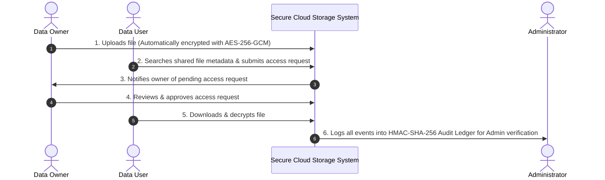

# 00 — Project Executive Overview

## 1. What is this Project?

**Secure Cloud Storage** is an enterprise-grade, privacy-preserving Java web application designed to store, manage, and share sensitive files in cloud environments without trusting the underlying cloud hosting provider with unencrypted data.

Unlike standard cloud storage systems (where cloud admins or infrastructure providers can read stored files in plaintext), this system implements **Zero-Trust Client-Side Envelope Encryption** and **Owner-Sovereign Access Control**:
- Files are encrypted using **AES-256-GCM** before being stored.
- Files cannot be downloaded or decrypted by anyone—including system administrators—without the explicit, cryptographic approval of the **Data Owner**.
- Every access decision, upload, download, and permission change is recorded in an **HMAC-SHA-256 Cryptographic Audit Ledger** to detect any data tampering or unauthorized modifications.

---

## 2. Why Do We Need This? (The Core Problem)

Traditional cloud storage platforms (e.g., standard S3 buckets or unencrypted file servers) present major security vulnerabilities:

```mermaid
graph TD
    subgraph Traditional Insecure Cloud Storage
        User1[User Uploads Plaintext File] --> CloudProvider[Cloud Storage Server]
        CloudProvider --> Risk1[Inside Employees / Admins Can View Data]
        CloudProvider --> Risk2[Cloud Breach Exposes All Customer Data]
        CloudProvider --> Risk3[No Immutable Audit Trail of Who Accessed What]
    end

    subgraph Secure Cloud Storage (This Project)
        User2[Data Owner Uploads File] --> EncryptEngine[AES-256-GCM Envelope Encryption]
        EncryptEngine --> EncryptedDB[(Encrypted Database Storage)]
        EncryptedDB --> Safeguard1[Cloud Provider Sees Only Ciphertext Binary]
        EncryptedDB --> Safeguard2[Requires Owner Approval to Unlock File]
        EncryptedDB --> Safeguard3[HMAC-SHA-256 Tamper-Evident Ledger Tracks Every Action]
    end
```

### The 4 Major Security Risks Addressed:
1. **Data Breaches & Cloud Exposures:** If a database backup or cloud disk is stolen, standard files are exposed immediately. In this project, stolen files are useless binary noise because every file is encrypted with a unique 256-bit AES key.
2. **Untrusted Cloud Hosts & Insider Threats:** System administrators or malicious cloud employees could read sensitive files. This project prevents key exposure by wrapping keys with deployment master secrets.
3. **Unauthorized File Sharing:** In standard systems, users can forward download links. Here, access requires an explicit, authenticated `APPROVED` record bound to the user's ID.
4. **Audit Log Tampering:** Malicious actors who breach a server often clear or alter access logs to hide their activities. This project chains all security events into an **HMAC-SHA-256 append-only ledger** where any record modification or deletion is detected instantly.

---

## 3. Purpose & Core Mission

The mission of **Secure Cloud Storage** is to provide **Zero-Trust Data Sovereignty** to file owners.

### Key Objectives:
- **Confidentiality:** Ensure that only authorized recipients can decrypt and view file content.
- **Integrity:** Detect any modification or corruption in stored files using GCM authentication tags and SHA-256 checksums.
- **Owner Sovereignty:** Give content creators (Data Owners) exclusive control over who receives permission to access their files.
- **Accountability & Non-Repudiation:** Maintain an un-alterable, cryptographically linked audit chain tracking every upload, access request, approval, and file download.

---

## 4. How It Is Used (Operating Model)

The application operates under a 3-role workflow:



1. **Data Owners:** Log in, upload files (which are instantly encrypted before saving), view pending access requests from users, and grant or deny access permissions.
2. **Data Users:** Log in, search available file titles/descriptions, send access requests to file owners, and download/stream decrypted files once approved.
3. **Administrators:** Oversee user accounts, monitor system health, and run cryptographic verification checks across the **Integrity Audit Ledger** to ensure no historical record has been tampered with.

---

## 5. Real-World Applications & Use Cases

This system is designed for industries and environments where data privacy, compliance, and strict access governance are required:

| Sector / Industry | Use Case Application | Security Benefit |
|---|---|---|
| 🏥 **Healthcare & Medical Records** | Sharing patient medical records, lab results, and genomic data between hospitals and specialists. | Enforces HIPAA/GDPR compliance; prevents unauthorized exposure of Sensitive Personal Health Information (PHI). |
| ⚖️ **Legal & Financial Services** | Exchanging confidential contracts, audit reports, merger documents, and client tax files. | Owner-approved distribution ensures legal privilege and prevents insider trading leaks. |
| 🛡️ **Defense & Intelligence** | Sharing classified mission data, intelligence reports, and tactical documents across departments. | Cryptographic audit ledger provides non-repudiable accountability for every intelligence request. |
| 🧪 **Enterprise Intellectual Property (R&D)** | Storing proprietary source code, trade secrets, industrial designs, and patent drafts. | Prevents corporate espionage; cloud hosting providers cannot read proprietary R&D data. |
| 🏛️ **Government & Citizen Services** | Managing citizen identity records, land deeds, and confidential government filings. | Protects public records against database tampering and unauthorized administrative access. |

---

## 6. Summary of Core Differentiators

| Feature | How It Protects You |
|---|---|
| **AES-256-GCM Envelope Encryption** | Each file has its own random 256-bit key wrapped with `APP_MASTER_KEY`. |
| **PBKDF2 Password Security** | 310,000 hashing iterations + per-account 16-byte random salts prevent rainbow table & brute-force attacks. |
| **HMAC-SHA-256 Audit Ledger** | Cryptographically chained event hashes detect any row deletion, insertion, or editing in audit history. |
| **Session-Bound CSRF Tokens** | Prevents malicious cross-site request forgery attacks on all forms. |
| **Strict Security Headers** | HSTS, CSP, X-Frame-Options (DENY), and X-Content-Type-Options protect against web exploits. |
