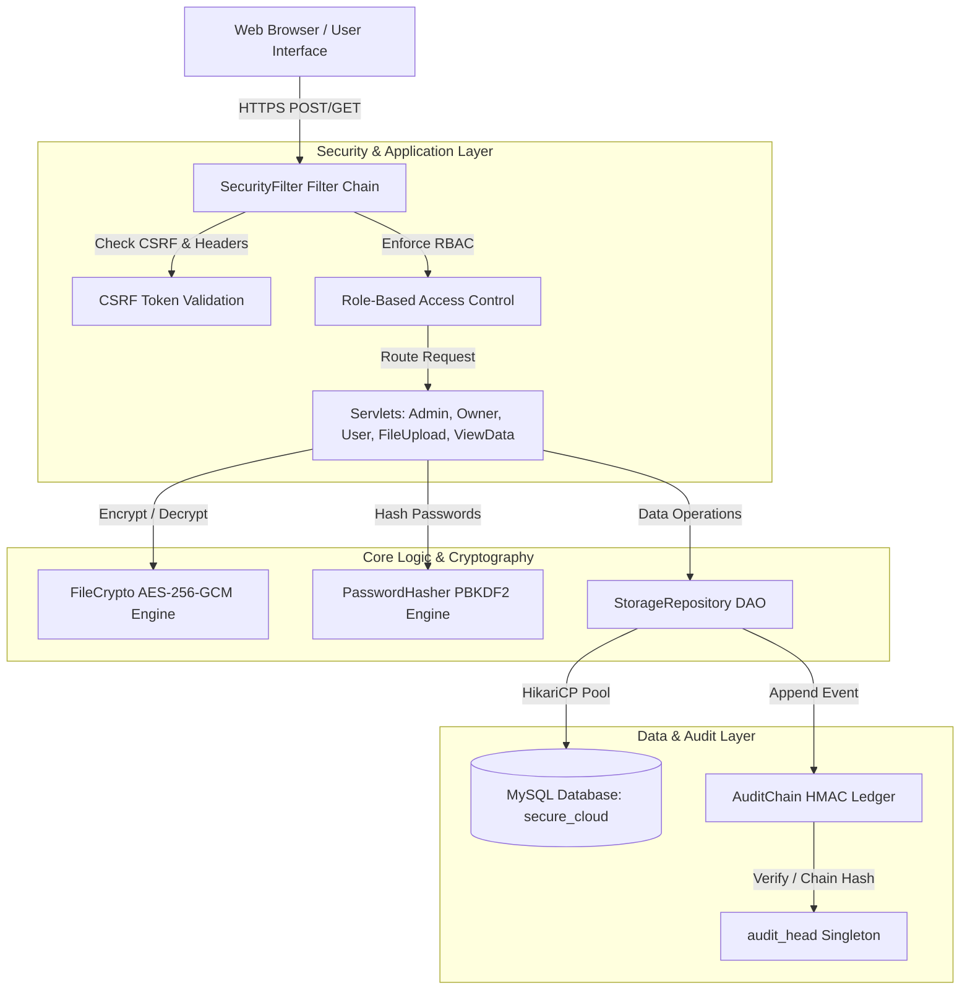

# 01 — Architecture Overview

## 1. System Purpose & Objectives

**Secure Cloud Storage** is a secure Java web application built on Java 17 Servlets and JSP. The application provides encrypted file storage, access request management, owner-approved file distribution, and tamper-evident audit logging.

The system enforces strict confidentiality, integrity, accountability, and authorization across all stored cloud assets.

---

## 2. Version 1 (Legacy Prototype) vs Version 2 Security Model

Version 2 completely re-architected the legacy prototype to replace insecure practices with enterprise security standards:

| Security Vector | Legacy Version 1 Prototype | Version 2 Enhanced Security Architecture |
|---|---|---|
| **Password Storage** | Plaintext / weak hashing | **PBKDF2-HMAC-SHA-256** with per-account random salt (310,000 iterations) |
| **File Encryption** | AES-ECB mode (insecure, patterns exposed) | **AES-256-GCM** authenticated envelope encryption (96-bit random nonce) |
| **Key Management** | Raw key transmitted in URL / plaintext | **Envelope Encryption**: 256-bit random AES key wrapped with `APP_MASTER_KEY` |
| **Database Queries** | Plaintext string concatenation (SQL Injection risk) | **100% Prepared Statements** with bound parameters & connection pooling |
| **Audit Ledger** | Unverifiable plain database records | **Cryptographic Audit Ledger**: HMAC-SHA-256 append-only chain (`APP_AUDIT_KEY`) |
| **Request Security** | No CSRF protection | **Session-bound CSRF tokens** required on all state-changing POST requests |
| **Access Control** | Weak query parameter checks | Enforced **Role-Based Access Control (RBAC)** filter (`SecurityFilter`) |
| **HTTP Security Headers** | Default HTTP headers | **Security Headers**: HSTS, CSP, X-Frame-Options (DENY), X-Content-Type-Options |

---

## 3. High-Level Architecture Diagram

---

## 4. System Layering Architecture

The codebase follows a clean 4-tier modular architecture:

### A. Presentation Layer (JSPs & HTML)
- **Servlets & Pages:** Provides responsive interfaces for Administrators (`Adminhome.jsp`), File Owners (`DataOwnerHome.jsp`), and Data Users (`DataUserHome.jsp`).
- **CSRF Token Embedding:** All forms dynamically include a session-bound `csrfToken` parameter.

### B. Security & Controller Layer (`com.security` & `com.servlets`)
- **`SecurityFilter`**: Central HTTP filter enforcing URL authorization, static asset bypass, CSRF token verification, and security headers.
- **`Csrf`**: Session-bound cryptographically strong token generation and verification.
- **`LoginAttemptLimiter`**: IP-based rate limiting to prevent brute-force authentication attacks.

### C. Data Access & Audit Layer (`com.dao`)
- **`DBConnection`**: Manages HikariCP high-performance connection pool with explicit MySQL driver registration.
- **`StorageRepository`**: Encapsulates all SQL operations using prepared statements, transaction management, and automatic audit event logging.

### D. Cryptographic Engine (`com.security.FileCrypto` & `PasswordHasher`)
- Provides AES-256-GCM authenticated encryption for uploaded files, data key wrapping/unwrapping, and PBKDF2 password derivation.

---

## 5. Role-Based Access Control (RBAC) Matrix

The system enforces 3 distinct roles:

| Action / Resource | Guest (Public) | Data Owner (`OWNER`) | Data User (`USER`) | Administrator (`ADMIN`) |
|---|:---:|:---:|:---:|:---:|
| **Public Landing & Register** | ✅ | ✅ | ✅ | ✅ |
| **Upload Files** | ❌ | ✅ | ❌ | ❌ |
| **View Own Uploaded Files** | ❌ | ✅ | ❌ | ❌ |
| **Manage Access Requests** | ❌ | ✅ (Approve / Deny) | ❌ | ❌ |
| **Search Shared Files** | ❌ | ❌ | ✅ | ❌ |
| **Send Access Request** | ❌ | ❌ | ✅ | ❌ |
| **Download / Decrypt File** | ❌ | ✅ (Own Files) | ✅ (If Approved) | ✅ (Audit Monitored) |
| **View All Registered Users** | ❌ | ❌ | ❌ | ✅ |
| **View System Audit Ledger** | ❌ | ❌ | ❌ | ✅ |
