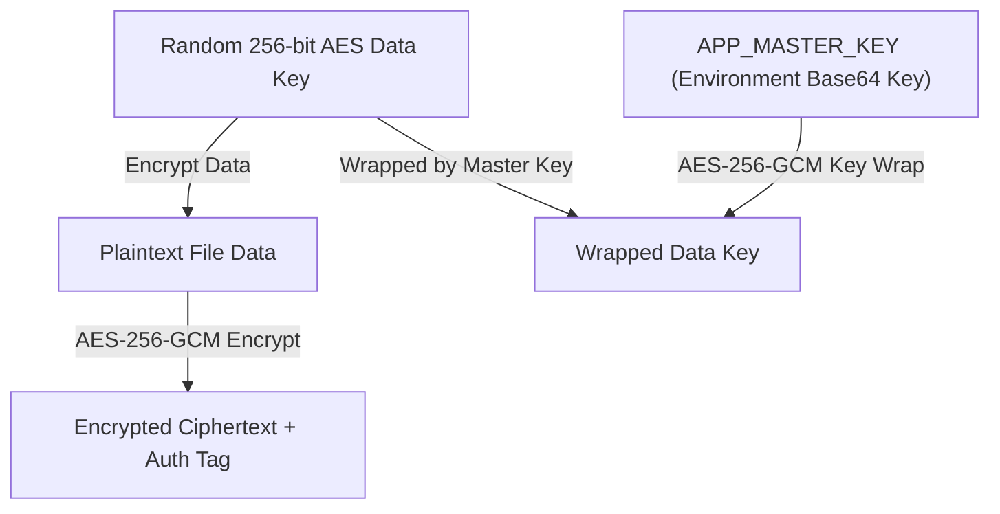

# 02 — Security & Cryptography

## 1. Cryptographic Overview

The application relies on standard algorithms from the **Java Cryptography Extension (JCE)** to enforce security for stored files, user credentials, sessions, and audit logs.

---

## 2. Password Hashing Architecture (`com.security.PasswordHasher`)

User passwords are never stored in plaintext or weak single-pass hashes (e.g., MD5 or plain SHA-256).

### Specifications:
- **Algorithm:** PBKDF2 with HMAC-SHA-256 (`PBKDF2WithHmacSHA256`)
- **Salt:** 16-byte (128-bit) cryptographically strong random salt generated per account via `java.security.SecureRandom`
- **Iterations:** `310,000` (OWASP recommended baseline)
- **Derived Key Length:** 256 bits (32 bytes)
- **Encoded Storage Format:**
  ```text
  pbkdf2-sha256$310000$<Base64-Encoded-Salt>$<Base64-Encoded-Derived-Hash>
  ```

### Password Verification Flow:
1. Extract salt, iteration count, and expected derived key from the stored hash string.
2. Re-derive the hash from the supplied login password using the extracted salt and iterations.
3. Compare expected and derived hash bytes using constant-time comparison `MessageDigest.isEqual()` to prevent timing attacks.

---

## 3. AES-256-GCM Envelope Encryption (`com.security.FileCrypto`)

All uploaded file contents are encrypted using **Authenticated Envelope Encryption** with AES-256 in Galois/Counter Mode (GCM).

### Key Architecture:



### Encryption Steps per File:
1. **Random Data Key Generation:** A fresh, random 256-bit AES key is generated for every uploaded file using `SecureRandom`.
2. **File Data Encryption:** The file data is encrypted with the random Data Key using `AES/GCM/NoPadding` with a fresh 96-bit (12-byte) initialization vector (nonce). GCM mode produces authenticated ciphertext containing an integrated 128-bit authentication tag.
3. **Envelope Key Wrapping:** The random Data Key itself is encrypted (wrapped) using the global application Deployment Master Key (`APP_MASTER_KEY`) with another fresh 96-bit nonce.
4. **Data Digest:** An SHA-256 digest of the encrypted ciphertext is calculated for integrity validation.

### Database Storage Layout per Encrypted File:
- `ciphertext`: Raw GCM encrypted binary payload
- `file_nonce`: 12-byte nonce used to encrypt file content
- `wrapped_key`: Envelope-wrapped 256-bit Data Key (64 bytes)
- `key_nonce`: 12-byte nonce used to wrap the Data Key
- `ciphertext_sha256`: 32-byte SHA-256 checksum of `ciphertext`

---

## 4. CSRF Protection Engine (`com.security.Csrf`)

To prevent Cross-Site Request Forgery (CSRF), all state-changing HTTP requests (`POST`) require a valid session-bound CSRF token.

### Mechanics:
1. When a user creates a session, `Csrf.ensure(request)` generates a 32-byte cryptographically random token, Base64-encoded, and stores it in `session.getAttribute("csrfToken")`.
2. JSP pages embed the CSRF token in all forms as a hidden input field:
   ```html
   <input type="hidden" name="csrfToken" value="${sessionScope.csrfToken}" />
   ```
3. `SecurityFilter` intercepts every `POST` request and checks `Csrf.valid(request)`:
   - Compares the `csrfToken` parameter from `POST` payload against `sessionScope.csrfToken`.
   - If invalid or missing, returns **HTTP 403 Forbidden ("Invalid CSRF token")**.

---

## 5. Brute-Force Rate Limiting (`com.security.LoginAttemptLimiter`)

To mitigate brute-force password guessing attacks, `LoginAttemptLimiter` tracks failed authentication attempts per IP address.

### Thresholds & Lockout Rules:
- **Maximum Failed Attempts:** 5 consecutive failed attempts
- **Lockout Duration:** 15 minutes exponential window
- **Automatic Reset:** Successful authentication clears failed attempt counts for the IP.

---

## 6. HTTP Security Headers (`SecurityFilter`)

Every HTTP response processed by `SecurityFilter` includes security response headers:

| Header Name | Configured Value | Security Function |
|---|---|---|
| `X-Content-Type-Options` | `nosniff` | Prevents MIME-type sniffing attacks |
| `X-Frame-Options` | `DENY` | Prevents Clickjacking by disallowing iframe embedding |
| `Referrer-Policy` | `no-referrer` | Prevents sensitive URL/token leakage in Referer headers |
| `Permissions-Policy` | `camera=(), microphone=(), geolocation=()` | Disables browser hardware APIs |
| `Content-Security-Policy` | `default-src 'self'; img-src 'self' data:; style-src 'self'; form-action 'self'; frame-ancestors 'none'; base-uri 'none'` | Enforces strict content origin policy |
| `Cache-Control` | `no-store` | Prevents caching of sensitive pages in browser history |
| `Strict-Transport-Security` | `max-age=31536000; includeSubDomains` | Enforces HTTPS connections (when request is secure) |
