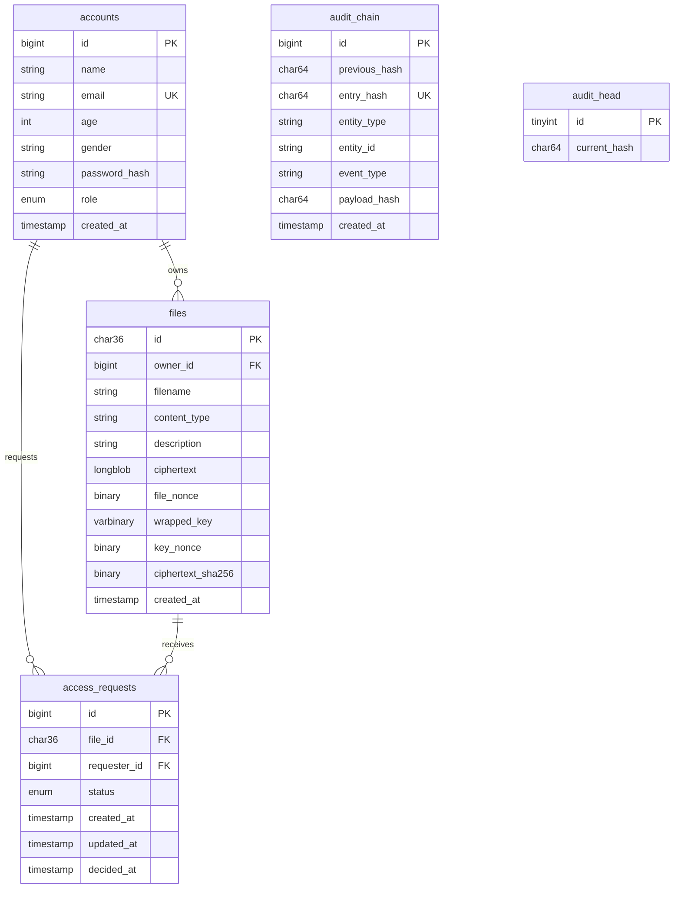

# 03 — Database & Audit Chain

## 1. Database Architecture

The application uses MySQL 8.4+ / MySQL 9.1+ with the **InnoDB** storage engine to support transactional integrity, foreign key constraints, binary columns, and full-text search.

- **Database Name:** `secure_cloud`
- **Character Set:** `utf8mb4`
- **Collation:** `utf8mb4_0900_ai_ci`

---

## 2. Entity-Relationship (ER) Diagram



---

## 3. Database Table Definitions

### Table 1: `accounts`
Stores registered user credentials, user details, and Role-Based Access Control roles.

| Column | Data Type | Constraints | Description |
|---|---|---|---|
| `id` | `BIGINT UNSIGNED` | `AUTO_INCREMENT`, `PRIMARY KEY` | Account identifier |
| `name` | `VARCHAR(100)` | `NOT NULL` | Full user name |
| `email` | `VARCHAR(254)` | `NOT NULL`, `UNIQUE` | Email / login username |
| `age` | `SMALLINT UNSIGNED` | `NOT NULL`, `CHECK (age BETWEEN 13 AND 120)` | User age |
| `gender` | `VARCHAR(30)` | `NOT NULL` | User gender |
| `password_hash` | `VARCHAR(255)` | `NOT NULL` | PBKDF2-HMAC-SHA-256 encoded hash |
| `role` | `ENUM('USER','OWNER','ADMIN')` | `NOT NULL` | Assigned role |
| `created_at` | `TIMESTAMP(6)` | `DEFAULT CURRENT_TIMESTAMP(6)` | Account creation timestamp |

---

### Table 2: `files`
Stores encrypted file payloads, cryptographic envelope keys, nonces, and metadata.

| Column | Data Type | Constraints | Description |
|---|---|---|---|
| `id` | `CHAR(36)` | `PRIMARY KEY` | UUID file identifier |
| `owner_id` | `BIGINT UNSIGNED` | `NOT NULL`, `FOREIGN KEY -> accounts(id)` | File owner account ID |
| `filename` | `VARCHAR(255)` | `NOT NULL` | Original filename |
| `content_type` | `VARCHAR(150)` | `NOT NULL` | MIME content type |
| `description` | `VARCHAR(2000)` | `NOT NULL` | File description |
| `ciphertext` | `LONGBLOB` | `NOT NULL` | AES-256-GCM encrypted file bytes |
| `file_nonce` | `BINARY(12)` | `NOT NULL` | 96-bit AES-GCM file nonce |
| `wrapped_key` | `VARBINARY(64)` | `NOT NULL` | Encrypted Data Key wrapped with `APP_MASTER_KEY` |
| `key_nonce` | `BINARY(12)` | `NOT NULL` | 96-bit key wrapping nonce |
| `ciphertext_sha256` | `BINARY(32)` | `NOT NULL` | SHA-256 checksum of `ciphertext` |
| `created_at` | `TIMESTAMP(6)` | `DEFAULT CURRENT_TIMESTAMP(6)` | Upload timestamp |

---

### Table 3: `access_requests`
Manages file download permission requests submitted by Data Users and decided by Data Owners.

| Column | Data Type | Constraints | Description |
|---|---|---|---|
| `id` | `BIGINT UNSIGNED` | `AUTO_INCREMENT`, `PRIMARY KEY` | Request ID |
| `file_id` | `CHAR(36)` | `NOT NULL`, `FOREIGN KEY -> files(id)` | Requested file ID |
| `requester_id` | `BIGINT UNSIGNED` | `NOT NULL`, `FOREIGN KEY -> accounts(id)` | User requesting access |
| `status` | `ENUM('PENDING','APPROVED','DENIED')` | `DEFAULT 'PENDING'` | Decision status |
| `created_at` | `TIMESTAMP(6)` | `DEFAULT CURRENT_TIMESTAMP(6)` | Submission timestamp |
| `updated_at` | `TIMESTAMP(6)` | `ON UPDATE CURRENT_TIMESTAMP(6)` | Last status update timestamp |
| `decided_at` | `TIMESTAMP(6)` | `NULL` | Timestamp of approval/denial |

---

### Table 4: `audit_chain` & Table 5: `audit_head`
Stores the append-only HMAC-SHA-256 tamper-evident security audit log.

```sql
CREATE TABLE audit_chain (
    id BIGINT UNSIGNED NOT NULL AUTO_INCREMENT,
    previous_hash CHAR(64) CHARACTER SET ascii COLLATE ascii_bin NOT NULL,
    entry_hash CHAR(64) CHARACTER SET ascii COLLATE ascii_bin NOT NULL,
    entity_type VARCHAR(40) NOT NULL,
    entity_id VARCHAR(64) NOT NULL,
    event_type VARCHAR(40) NOT NULL,
    payload_hash CHAR(64) CHARACTER SET ascii COLLATE ascii_bin NOT NULL,
    created_at TIMESTAMP(6) NOT NULL,
    PRIMARY KEY (id),
    UNIQUE KEY uq_audit_entry_hash (entry_hash)
) ENGINE=InnoDB;

CREATE TABLE audit_head (
    id TINYINT UNSIGNED NOT NULL PRIMARY KEY CHECK (id = 1),
    current_hash CHAR(64) CHARACTER SET ascii COLLATE ascii_bin NOT NULL
);
```

---

## 4. Cryptographic Audit Chain Mechanics (`APP_AUDIT_KEY`)

Every major system action (`FILE_UPLOAD`, `FILE_DOWNLOAD`, `ACCESS_REQUEST`, `REQUEST_DECISION`) enters an **HMAC-SHA-256 append-only cryptographic chain**.


### HMAC Entry Calculation Formula:
$$\text{EntryHash} = \text{HMAC-SHA256}(\text{APP\_AUDIT\_KEY}, \text{previousHash} \parallel ":" \parallel \text{entityType} \parallel ":" \parallel \text{entityId} \parallel ":" \parallel \text{eventType} \parallel ":" \parallel \text{payloadHash} \parallel ":" \parallel \text{createdAt})$$

### Tamper Detection Validation Algorithm:
1. When an Administrator views the **Integrity Audit** screen (`/BlocksData.jsp`), `StorageRepository.auditEntries()` executes a full verification pass across all historical audit entries.
2. Re-calculates the expected HMAC entry hash for each record sequentially using the previous record's hash.
3. If any past row has been modified, deleted, inserted, or re-ordered, the verification fails for that entry and marks `valid = false` on screen.
