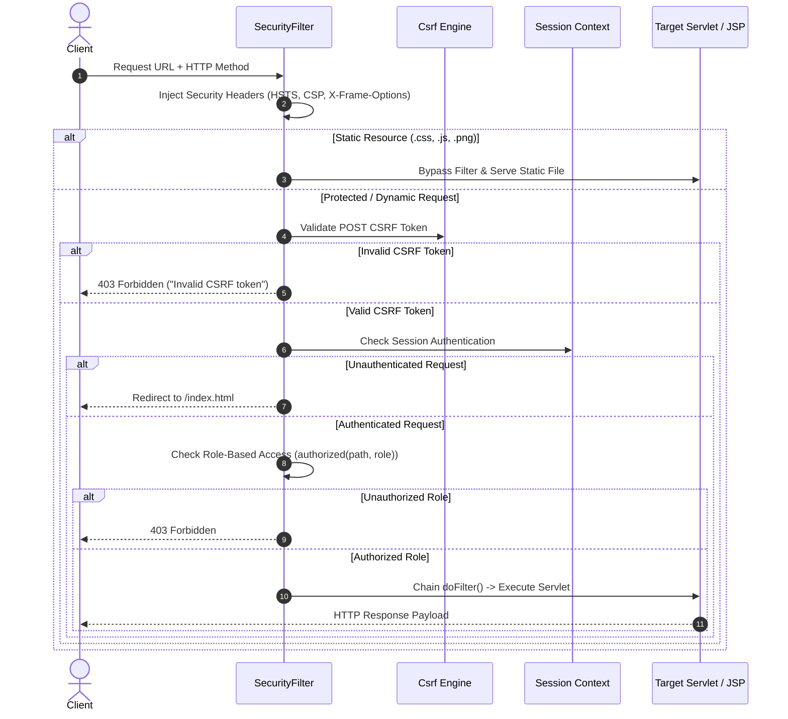

# 04 — API & Servlets

## 1. Servlet Architecture Overview

The backend logic is structured as modular Java Servlets registered under the `com.servlets` package. Each Servlet handles specialized actions such as authentication, registration, file upload, authorization processing, file streaming, and session termination.

All Servlets extend `javax.servlet.http.HttpServlet` and rely on `com.servlets.ServletSupport` for session management and error forwarding.

---

## 2. Servlet Routing Catalog

| Servlet Class | URL Pattern | Allowed Methods | Required Role | Functionality |
|---|---|---|---|---|
| `Admin` | `/Admin` | `POST` | Public | Administrator login authentication |
| `Owner` | `/Owner` | `POST` | Public | Data Owner login authentication |
| `OwnerReg` | `/OwnerReg` | `POST` | Public | Data Owner account registration |
| `User` | `/User` | `POST` | Public | Data User login authentication |
| `UserReg` | `/UserReg` | `POST` | Public | Data User account registration |
| `FileUpload` | `/FileUpload` | `POST` | `OWNER` | Multi-part file upload, AES-256-GCM encryption, and DB storage |
| `ViewData` | `/ViewData` | `GET` | `USER` / `OWNER` | Decrypts and streams file binary data to browser for download |
| `ViewData1` | `/ViewData1` | `GET` | `USER` / `OWNER` | Alias endpoint for file view and verification |
| `SendRequest` | `/SendRequest` | `POST` | `USER` | Submits a file access request to the file's owner |
| `Approve` | `/Approve` | `POST` | `OWNER` | Approves or denies a Data User's access request |
| `SendKey` | `/SendKey` | `POST` | `OWNER` | Legacy key dispatch alias / approval confirm |
| `DeleteFile` | `/DeleteFile` | `POST` | `OWNER` | Deletes an owned file and cascades related access records |
| `Logout` | `/Logout` | `POST` / `GET` | Authenticated | Invalidates HTTP session and redirects to `index.html` |
| `PageServlet` | `/PageServlet` | `GET` | Public | Renders public HTML pages (`contact.html`, `features.html`, etc.) |

---

## 3. Filter Execution Lifecycle (`SecurityFilter`)

Every incoming HTTP request undergoes filter processing before reaching any target Servlet or JSP page:

---

## 4. Detailed Servlet Specifications

### A. `FileUpload.java` (`/FileUpload`)
- **Annotation:** `@WebServlet("/FileUpload")`, `@MultipartConfig`
- **Max File Size:** Configured for multipart binary file uploads
- **Processing Logic:**
  1. Extracts file parameters (`file`, `description`, `filename`, `content_type`).
  2. Passes plaintext file bytes to `FileCrypto.encrypt(bytes, masterKey)`.
  3. Saves encrypted binary payload and cryptographic nonces into `files` table via `StorageRepository.saveFile()`.
  4. Automatically records `FILE_UPLOAD` event into the HMAC-SHA-256 audit ledger.

### B. `ViewData.java` (`/ViewData`)
- **Annotation:** `@WebServlet("/ViewData")`
- **Authorization Check:** Ensures requester is either the file owner, an administrator, or has an `APPROVED` access request record in `access_requests`.
- **Processing Logic:**
  1. Retrieves `ciphertext`, `file_nonce`, `wrapped_key`, and `key_nonce` from database.
  2. Decrypts file data using `FileCrypto.decrypt(storedFile, masterKey)`.
  3. Sets response headers (`Content-Type`, `Content-Disposition: attachment; filename="..."`).
  4. Streams decrypted bytes to `response.getOutputStream()`.
  5. Automatically records `FILE_DOWNLOAD` event in the audit chain.

### C. `Approve.java` (`/Approve`)
- **Annotation:** `@WebServlet("/Approve")`
- **Processing Logic:**
  1. Validates that current session user owns the requested file.
  2. Updates request status to `APPROVED` or `DENIED` in `access_requests` table.
  3. Records `REQUEST_DECISION` audit entry.

### D. `ServletSupport.java`
- Helper utility class providing uniform methods across servlets:
  - `ServletSupport.currentAccount(request)`: Extracts session account details.
  - `ServletSupport.requireRole(request, response, role)`: Verifies role preconditions.
  - `ServletSupport.forwardError(request, response, page, message)`: Standardized error dispatching.
