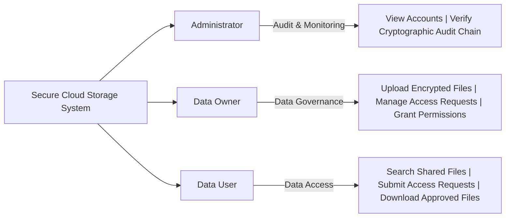
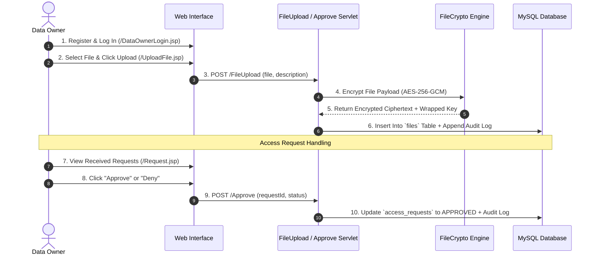
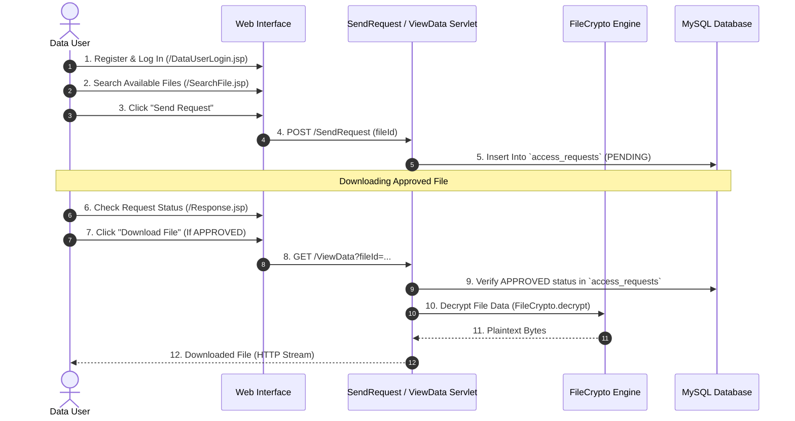

# 05 — User Workflows & Roles

## 1. User Roles Overview

The system categorizes users into three distinct roles, each tailored with specific interface workflows:

---

## 2. Data Owner Journey & Workflows

Data Owners are content creators who upload files into the cloud storage system and maintain full authority over access permissions.

### Key Owner Screens:
- **Registration:** `DataOwnerRegister.jsp` -> `/OwnerReg`
- **Dashboard:** `DataOwnerHome.jsp`
- **File Upload:** `UploadFile.jsp` -> `/FileUpload`
- **View Owned Files:** `ViewOwnFiles.jsp`
- **Pending Access Requests:** `Request.jsp` -> `/Approve`

---

## 3. Data User Journey & Workflows

Data Users search the cloud repository, submit access requests for files, and download/decrypt files once approved by the file owner.

### Key User Screens:
- **Registration:** `DataUserRegister.jsp` -> `/UserReg`
- **Dashboard:** `DataUserHome.jsp`
- **Search Files:** `SearchFile.jsp` / `SearchResult.jsp`
- **Submit Request:** `/SendRequest`
- **View Approved Responses:** `Response.jsp` -> `/ViewData`

---

## 4. Administrator Journey & Workflows

Administrators oversee system operations, view all registered Data Owners and Data Users, and audit the cryptographic tamper-evident ledger.

### Key Administrator Screens:
- **Admin Sign In:** `Admin.jsp` -> `/Admin`
- **Admin Dashboard:** `Adminhome.jsp`
- **View Data Owners:** `DataOwnerInfo.jsp`
- **View Data Users:** `DataUserInfo.jsp`
- **Integrity Audit:** `BlocksData.jsp` -> Audits the HMAC-SHA-256 ledger (`audit_chain`)
